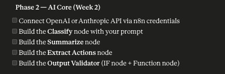
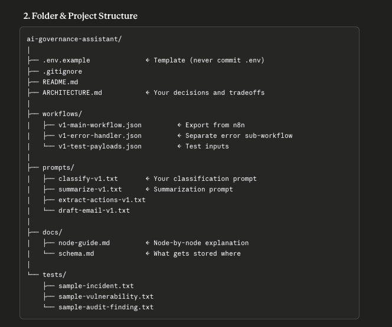
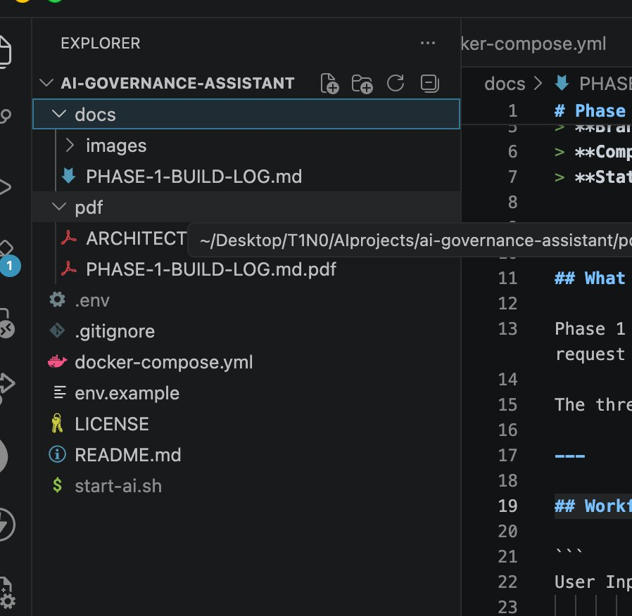
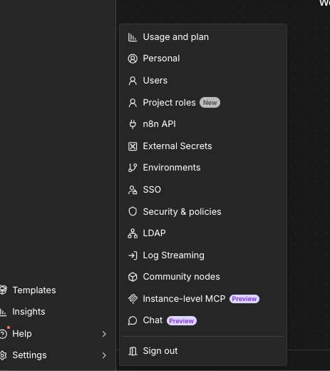
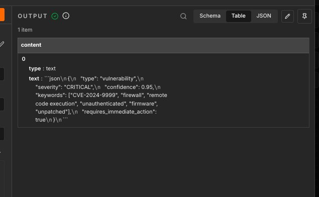
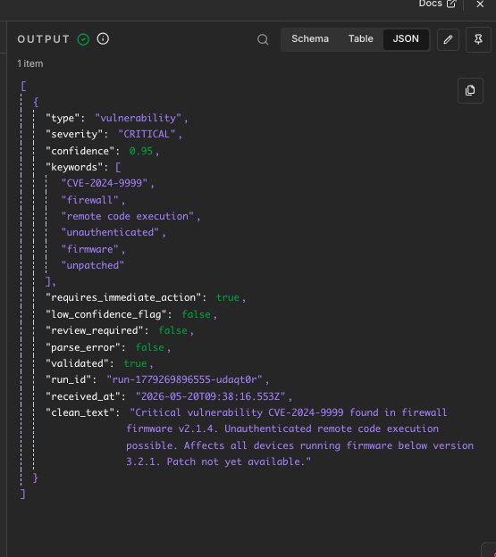
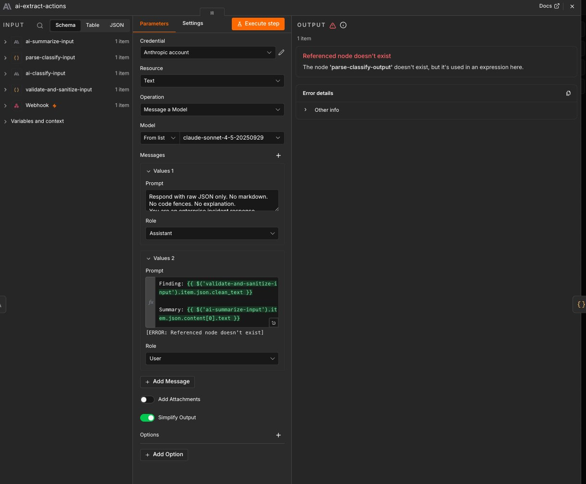
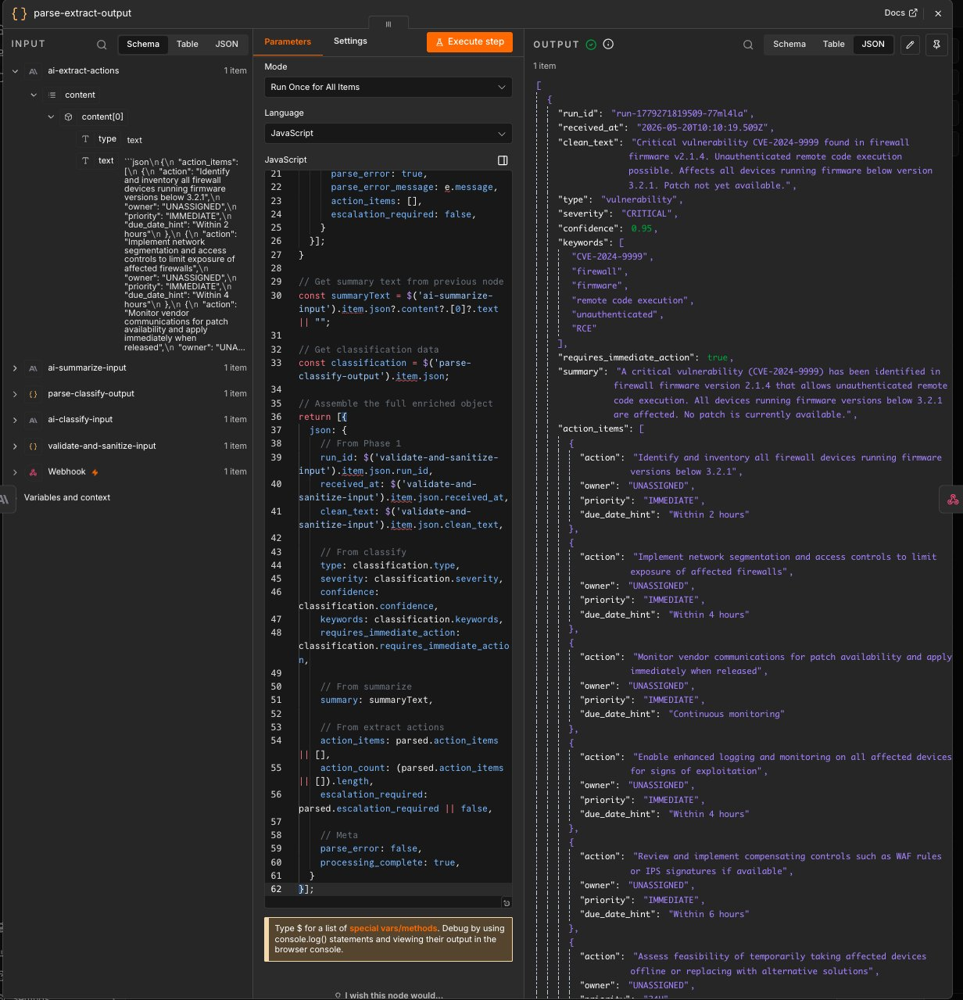
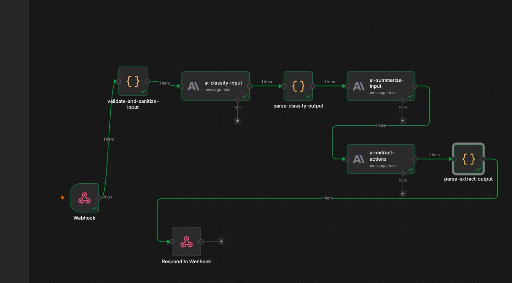

# Phase 2 — AI Core Build Log

> **Project:** AI Governance & Incident Assistant  
> **Phase:** 2 — AI Core  
> **Branch:** `phase-2-ai-core`  
> **Completed:** May 2026  
> **Status:** ✅ Complete

---

## What Was Built

Phase 2 connects the AI brain to the pipeline established in Phase 1. Six new nodes were added — three Anthropic Claude AI nodes for classification, summarization, and action extraction, plus three Code nodes to parse, validate, and enrich the AI outputs into clean structured JSON.

By the end of this phase, a single text input produces a fully enriched object containing severity classification, a professional summary, and a structured list of action items — all tied together by the `run_id` from Phase 1.

---

## Phase 2 Checklist



---

## Project Folder — Before and After

### Target folder structure (reference)



### Actual VS Code project folder at start of Phase 2



**Folder cleanup done before starting Phase 2:**
- Deleted `pdf/` folder — not needed in repo
- Renamed `env.example` → `.env.example`
- Created missing `workflows/`, `prompts/`, `tests/` directories
- Exported Phase 1 workflow JSON to `workflows/v1-main-workflow.json`

---

## Setting Up Anthropic API Credentials

### Finding Credentials in n8n

Credentials are NOT in the admin settings menu. This was discovered during Phase 2 setup.



**The correct path:** Credentials are added from **inside a workflow node** — open any Anthropic node → click the Credential dropdown → "Create new credential" → paste API key → Save.

This approach was used for all three AI nodes in this phase. The API key is stored encrypted by n8n using the `N8N_ENCRYPTION_KEY` set in the `.env` file. It never appears in workflow exports or repository files.

---

## Pipeline Overview

```
Webhook
  ↓
validate-and-sanitize-input     [Phase 1]
  ↓
ai-classify-input               [Phase 2 — Node 1]
  ↓
parse-classify-output           [Phase 2 — Node 2]
  ↓
ai-summarize-input              [Phase 2 — Node 3]
  ↓
ai-extract-actions              [Phase 2 — Node 4]
  ↓
parse-extract-output            [Phase 2 — Node 5]
  ↓
Respond to Webhook
```

---

## Node 1 — ai-classify-input (Anthropic)

**Purpose:** Send the sanitized input to Claude and get a structured classification back — type, severity, confidence score, keywords, and whether immediate action is required.

**Configuration:**

| Field | Value | Why |
|---|---|---|
| Resource | Text | We're sending and receiving text |
| Operation | Message a Model | Core completion call |
| Model | `claude-sonnet-4-5-20250929` | Fast, reliable, strong at structured output |
| Temperature | `0.1` | Low = consistent, deterministic classification |
| Simplify Output | OFF | Keeps full response structure for downstream parsing |

**System prompt:**
```
Respond with raw JSON only. No markdown. No code fences. No explanation.
You are an enterprise security and governance analyst.
Classify the following finding and respond ONLY with valid JSON.

Output format:
{
  "type": "incident|vulnerability|audit|governance|ssp|vendor|patch|ticket",
  "severity": "CRITICAL|HIGH|MEDIUM|LOW|INFO",
  "confidence": 0.95,
  "keywords": ["keyword1", "keyword2"],
  "requires_immediate_action": true
}
```

**User message expression:**
```
{{ $('validate-and-sanitize-input').item.json.clean_text }}
```

**Why reference `clean_text` directly?** Because the validated, sanitized text from Phase 1 is what the AI should see — not the raw webhook body. This enforces the security layer built in Phase 1.

---

## Node 2 — parse-classify-output (Code Node)

**Purpose:** Strip markdown fences from Claude's response, parse into real JSON, validate required fields, apply confidence gate, and re-attach the `run_id` and `clean_text` from Phase 1.

### The Problem This Node Solves

Claude's first raw output contained markdown code fences wrapping the JSON:



The raw text looked like:
```
```json
{
  "type": "vulnerability",
  "severity": "CRITICAL",
  ...
}
```
```

This cannot be parsed as JSON by downstream nodes. The parse node strips the fences and converts it to a proper JSON object.

### After Parsing — Clean Output



**What the output object contains:**

| Field | Value | Source |
|---|---|---|
| `type` | `vulnerability` | Claude classification |
| `severity` | `CRITICAL` | Claude classification |
| `confidence` | `0.95` | Claude classification |
| `keywords` | `[CVE-2024-9999, firewall, RCE...]` | Claude classification |
| `requires_immediate_action` | `true` | Claude classification |
| `low_confidence_flag` | `false` | Confidence gate (< 0.6 flags for review) |
| `review_required` | `false` | Confidence gate |
| `parse_error` | `false` | Parsing succeeded |
| `validated` | `true` | All required fields present |
| `run_id` | `run-177926...` | Carried from Phase 1 |
| `received_at` | `2026-05-20T...` | Carried from Phase 1 |
| `clean_text` | `"Critical vulnerability..."` | Carried from Phase 1 |

**Full code:**

```javascript
// ============================================================
// Node:    parse-classify-output
// Purpose: Strip markdown fences from AI response and parse
//          into clean JSON that downstream nodes can use
// Version: 1.0
// Phase:   2 — AI Core
// ============================================================

const rawResponse = $input.first().json?.content?.[0]?.text || "";

const stripped = rawResponse
  .replace(/^```json\s*/i, "")
  .replace(/^```\s*/i, "")
  .replace(/```\s*$/i, "")
  .trim();

let parsed;
try {
  parsed = JSON.parse(stripped);
} catch (e) {
  return [{
    json: {
      parse_error: true,
      parse_error_message: e.message,
      raw_response: rawResponse,
      validated: false,
    }
  }];
}

const requiredFields = ["type", "severity", "confidence", "keywords", "requires_immediate_action"];
const missingFields = requiredFields.filter(f => !(f in parsed));

if (missingFields.length > 0) {
  return [{
    json: {
      parse_error: true,
      parse_error_message: `Missing fields: ${missingFields.join(", ")}`,
      raw_response: rawResponse,
      validated: false,
    }
  }];
}

if (parsed.confidence < 0.6) {
  parsed.low_confidence_flag = true;
  parsed.review_required = true;
} else {
  parsed.low_confidence_flag = false;
  parsed.review_required = false;
}

return [{
  json: {
    ...parsed,
    parse_error: false,
    validated: true,
    run_id: $('validate-and-sanitize-input').item.json.run_id,
    received_at: $('validate-and-sanitize-input').item.json.received_at,
    clean_text: $('validate-and-sanitize-input').item.json.clean_text,
  }
}];
```

---

## Node 3 — ai-summarize-input (Anthropic)

**Purpose:** Generate a 2–3 sentence factual summary of the finding using the classification context.

**Configuration:**

| Field | Value | Why |
|---|---|---|
| Temperature | `0.3` | Slightly higher than classify — natural language needs a little flexibility |
| Simplify Output | OFF | Keeps full response structure |

**System prompt:**
```
Respond with plain text only. No markdown. No bullet points. No headers.
You are a senior technical writer for an enterprise security team.
Summarize the following finding in exactly 2-3 sentences.
Be factual. Do not speculate. Do not add information not present in the input.
```

**User message expression:**
```
Finding: {{ $('validate-and-sanitize-input').item.json.clean_text }}
Classification: Type is {{ $json.type }}, Severity is {{ $json.severity }}.
```

**Why include classification in the summarize prompt?** Giving Claude the classification context means the summary uses correct enterprise language — it knows it's summarizing a CRITICAL vulnerability, not a general finding.

---

## Node 4 — ai-extract-actions (Anthropic)

**Purpose:** Extract structured action items from the finding — each with an action description, owner, priority level, and due date hint.

**Configuration:**

| Field | Value |
|---|---|
| Temperature | `0.1` |
| Simplify Output | OFF |

**System prompt:**
```
Respond with raw JSON only. No markdown. No code fences. No explanation.
You are an enterprise incident response coordinator.
Extract all action items from the following finding.

Output format:
{
  "action_items": [
    {
      "action": "string",
      "owner": "string or UNASSIGNED",
      "priority": "IMMEDIATE|24H|72H|7DAYS",
      "due_date_hint": "string or null"
    }
  ],
  "escalation_required": true
}
```

**User message expression:**
```
Finding: {{ $('validate-and-sanitize-input').item.json.clean_text }}
Summary: {{ $('ai-summarize-input').item.json.content[0].text }}
Severity: {{ $('parse-classify-output').item.json.severity }}
```

---

## Node 5 — parse-extract-output (Code Node)

**Purpose:** Parse the action items JSON, assemble the final enriched object with all data from all previous nodes, and pass it forward as a single clean object.

**Full code:**

```javascript
// ============================================================
// Node:    parse-extract-output
// Purpose: Parse action items and assemble the final
//          enriched object from all pipeline stages
// Version: 1.0
// Phase:   2 — AI Core
// ============================================================

const rawResponse = $input.first().json?.content?.[0]?.text || "";

const stripped = rawResponse
  .replace(/^```json\s*/i, "")
  .replace(/^```\s*/i, "")
  .replace(/```\s*$/i, "")
  .trim();

let parsed;
try {
  parsed = JSON.parse(stripped);
} catch (e) {
  return [{
    json: {
      parse_error: true,
      parse_error_message: e.message,
      action_items: [],
      escalation_required: false,
    }
  }];
}

const summaryText = $('ai-summarize-input').item.json?.content?.[0]?.text || "";
const classification = $('parse-classify-output').item.json;

return [{
  json: {
    run_id: $('validate-and-sanitize-input').item.json.run_id,
    received_at: $('validate-and-sanitize-input').item.json.received_at,
    clean_text: $('validate-and-sanitize-input').item.json.clean_text,
    type: classification.type,
    severity: classification.severity,
    confidence: classification.confidence,
    keywords: classification.keywords,
    requires_immediate_action: classification.requires_immediate_action,
    summary: summaryText,
    action_items: parsed.action_items || [],
    action_count: (parsed.action_items || []).length,
    escalation_required: parsed.escalation_required || false,
    parse_error: false,
    processing_complete: true,
  }
}];
```

---

## Bugs Encountered and Fixed

### Bug 1 — Markdown Code Fences in AI Output

**Problem:** Claude wrapped JSON output in ` ```json ``` ` markdown fences. Downstream nodes couldn't parse it as JSON.

**Fix:** Added `parse-classify-output` Code node to strip fences before parsing. Also added `"Respond with raw JSON only. No markdown. No code fences."` to system prompts to reduce recurrence.

**Evidence:** See screenshot 06 (raw output with fences) vs screenshot 07 (clean parsed JSON).

---

### Bug 2 — Wrong Node Name in Expression

**Problem:** `ai-extract-actions` user message referenced `$('parse-classify-output')` but the node on canvas was named `parse-classify-input`. Node name mismatch caused a "Referenced node doesn't exist" error.



**Fix:** Renamed `parse-classify-input` → `parse-classify-output` on the canvas to match the expression reference.

**Lesson:** Node names are part of your code. A rename on the canvas breaks every expression that references the old name. Pick names carefully from the start and never rename a node that's already referenced downstream.

---

### Bug 3 — Role Set to "Assistant" Instead of "System"

**Problem:** The system prompt message in `ai-extract-actions` had its Role set to `Assistant` instead of `System`. This meant Claude did not receive the instruction as a system-level directive.

**Fix:** Changed Values 1 Role from `Assistant` → `System`.

---

### Bug 4 — Simplify Output Toggled On

**Problem:** n8n's "Simplify Output" toggle was ON by default on Anthropic nodes. This restructures the response object and breaks the `content[0].text` path used in downstream Code nodes.

**Fix:** Turned Simplify Output **OFF** on all three Anthropic nodes.

**Lesson:** Always turn Simplify Output off when you need to reference the raw response structure in a Code node. The simplified format is convenient for quick reads but breaks programmatic access.

---

## Final Output — Phase 2 Complete

### parse-extract-output — Full Enriched Object



**Complete output object verified:**

| Field | Value | Status |
|---|---|---|
| `run_id` | `run-1779271819509-77m14la` | ✅ Audit trail from Phase 1 |
| `received_at` | `2026-05-20T10:10:19.509Z` | ✅ Timestamp preserved |
| `clean_text` | Full sanitized input | ✅ Original input carried through |
| `type` | `vulnerability` | ✅ Correctly classified |
| `severity` | `CRITICAL` | ✅ Correctly identified |
| `confidence` | `0.95` | ✅ High confidence |
| `keywords` | CVE-2024-9999, firewall, RCE... | ✅ Extracted |
| `requires_immediate_action` | `true` | ✅ Correct |
| `summary` | 2–3 sentence professional brief | ✅ Factual, no speculation |
| `action_items` | 5 structured actions with priority | ✅ IMMEDIATE priority assigned |
| `escalation_required` | included | ✅ Present |
| `processing_complete` | `true` | ✅ Pipeline ran clean |

### Canvas — Full Pipeline All Green



All 8 nodes green. Clean data flow from Webhook through to parse-extract-output.

---

## Key Engineering Lessons from Phase 2

**1. Never trust AI output directly — always parse and validate**
Claude returned valid content but wrapped in markdown. The parse node is not optional — it's a required safety layer between every AI node and the rest of the pipeline.

**2. Node names are part of your code**
Expressions like `$('parse-classify-output').item.json` are hard references to node names. Treat renaming a node the same way you'd treat renaming a variable — check every reference before committing.

**3. Temperature is a deliberate choice, not a default**
Classification uses `0.1` — consistency over creativity. Summarization uses `0.3` — enough flexibility for natural language while staying controlled. Never leave temperature at default without thinking about what the node is doing.

**4. Simplify Output breaks programmatic access**
n8n's Simplify Output is convenient for reading results manually. Always turn it off when a Code node downstream needs to access the raw response structure.

**5. The confidence gate is your hallucination guard**
Any classification with confidence below 0.6 is flagged `review_required: true`. This means low-confidence AI outputs don't silently flow through the pipeline — they get flagged for human review. This is non-negotiable in a governance workflow.

**6. Carry context forward deliberately**
Every node in this phase explicitly re-attaches `run_id`, `received_at`, and `clean_text` from Phase 1. This is intentional — the final output object is self-contained. Anyone reading a stored result can trace it back to the original input without needing to query another table.

---

## What's Next — Phase 3

**Branch:** `phase-3-outputs`

| Node | Purpose |
|---|---|
| `ai-draft-email` | Claude writes a professional response email from the enriched object |
| `send-email` | Gmail/SMTP node sends the email |
| `store-to-sheets` | Google Sheets appends a full audit row |
| `respond-to-webhook` | Returns the complete enriched JSON to the caller |

**Exit criteria for Phase 3:** Full pipeline runs end-to-end. Input goes in → email sent → row stored in Google Sheets → JSON returned to caller.

---

*Part of a hands-on learning project building enterprise-grade AI governance workflows on n8n.*
